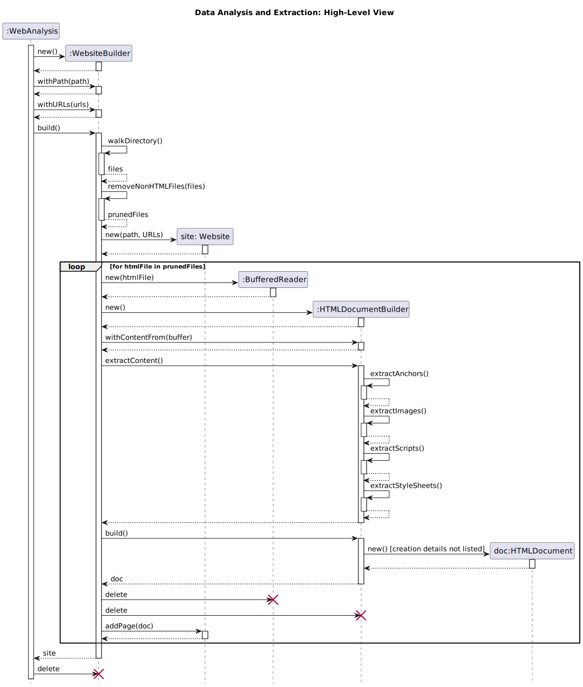

# Program Flow

In total... there are three distinct phases into which WebAnalysis program
logic can be divided:

  1. Data Analysis and Extraction
  2. Data Normalization (e.g., path and URL normalization)
  3. Report Generation


## Data Analysis and Extraction

Let us examine the actual analysis. *Note that we will focus on the broad
strokes.* Details such as `Exception`s, page count checks, path
validation/checks, and URL validation will not be included.




**Note that we did not cover the creation details of `HTMLDocument` objects
within the `HTMLDocumentBuilder.build` method.** I will leave this part up to
you. Take note of how

  1. all `HTMLDocumentBuilder` objects are destroyed
  2. `WebsiteBuilder` is destroyed
  3. all `BufferedReader` objects are destroyed

We have populated the `site` (`Website` object) with all the `HTMLDocument`
objects. The analysis objects are no longer needed.


### Creation & Deletion

Take note of the `new` and `delete` function "calls."

  1. `new` represents a call to a constructor (i.e., creating a new object)

  2. `delete` represents an object being "deallocated" (i.e., leaving scope and
     being discarded)

     *Even though Java is a Garbage Collected language wherein memory
     management is not handled explicitly by a programmer... designing around
     (and making use of) object lifetimes is **still** important.* **(Even if
     some teachers are cavalier in their approach.)**


## Further Analysis

I will leave the intermediary steps (i.e., all steps until report generation)
up to you and your team.


## Report Generation

Since the *Builder* objects have been destroyed... we no longer need to
consider them.


## Generating the Reports - Implementation

Working with text files can be accomplished with the Java `BufferedWriter` and
`FileWriter` classes. The other reports require external libraries. In total
(including HTML parsing) the following libraries should be utilized...


| Organization      | Artifact ID   | Version   | Gradle Dependency                | Description                                                                      |
| :------------:    | :-----------: | --------- | --------------                   | --------------------------                                                       |
| **org.jsoup**     | jsoup         | 1.16.1    | org.jsoup:jsoup:1.16.1           | [HTML Parsing](https://jsoup.org/)                                               |
| org.apache.poi    | poi           | 5.2.3+    | org.apache.poi:poi:5.2.3+        | [Read/write Microsoft document formats](https://poi.apache.org/)                 |
| org.apache.poi    | poi-ooxml     | 5.2.3+    | org.apache.poi:poi-ooxml:5.2.3+  | [Read & write Excel spreadsheets](https://poi.apache.org/spreadsheet/index.html) |
| com.cedarsoftware | json-io       | 4.14.0    | com.cedarsoftware:json-io:4.14.0 | [JSON Export/Import](https://github.com/jdereg/json-io)                          |

The table should be familiar... it is listed on the [Design Notes
page](https://www.cs.odu.edu/~tkennedy/cs350/latest/Protected/websiteAnalysisDesignNotes)
for the Semester Project. The *Gradle Dependency* column even lists the
specific dependency for use in `build.gradle`

I recommend adding...

```
    implementation 'org.jsoup:jsoup:1.16.1'
    implementation 'org.apache.poi:poi:5.2.3+'
    implementation 'org.apache.poi:poi-ooxml:5.2.3+'
    implementation 'com.cedarsoftware:json-io:4.14.0'
```

to the dependency block within your team's `build.gradle` file.

