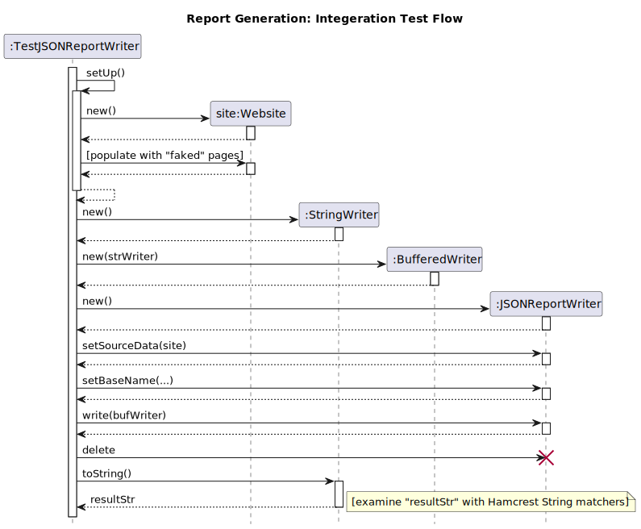

# Integration Tests - High-Level View

The Report Writers need to be tested. Since the Report Writers need to retrieve
data from

  - `Website`
  - `HTMLDocument`
  - `Resource` and its associated classes

and make use of various support libraries... the resulting tests are
*Integration Tests*.

For the purpose of this discussion... we will use the following definitions:

  - **Unit Test** - a test that examines a single class without involving other
    classes.

  - **Integration Test** - a test that examines the interaction between two or
    more classes.

  - **System Test** - a test the examines the program as a whole (start to
    finish).

    *The line between integration and system tests is often fuzzy.*

For *Unit Test* suites... the *mutator-accessor* strategy provides a framework for
constructing a test...
 
  1. Set up the object to be tested
  2. Call the *mutator* function under evaluation
  3. Call each accessor to confirm that:
      1. The expected change was made.
      2. No unexpected changes were made.

Integration tests require a different approach. Our steps will become something
along the lines of...

  1. Remember that if we are testing code that uses an existing library, either
     built-in (e.g., `BufferedReader`) or external (e.g., JSoup)...

     1. We are testing our code and how it uses the library.
     2. We are not testing the library itself.

  2. Set up a small set of test data (i.e., small enough to check by hand).

  3. Check the results of calling the library, not the library itself.

     *This is a nuanced difference.* Do not worry... there will be an example
     later in this discussion.

## Testing the Report Writers

The Report Writers will be tested with Integration Tests.

### Text Writer Test

Let us take a quick look of logic involved in testing the `TextReportWriter`.

Take note of how a `BufferWriter` and a `StringWriter` were used to capture the
output. This is a standard trick... and the reason why I emphasize the use of
`BufferedWriter` and `BufferedReader` so heavily.

### JSON Writer Test

Let us also take a quick look of logic involved in testing the
`JSONReportWriter`.

Do the steps seem familiar? In fact... they are near identical due to the fact
that JSON is just formatted text data.

**Now... what does the code entail? How do we approach these tests?**

Let us take a look at
<https://github.com/cstkennedy/cs350-examples/tree/master/Office-Hours/OfficeHours-JSON-IO>.
