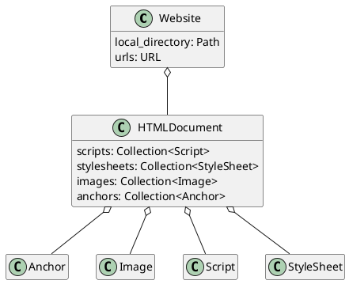
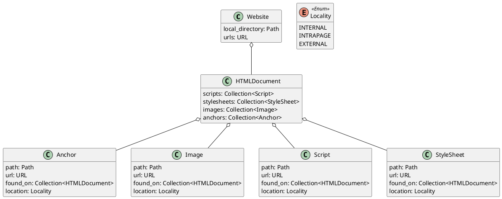
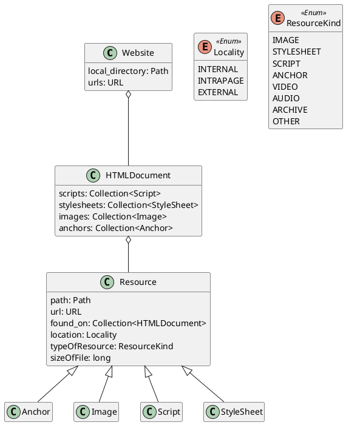

---
title: Brainstorming - Web Analysis
toc: yes
author: Thomas J. Kennedy
--- 

# Overview

This lecture is discussion of how I would approach identifying classes for the
Web Analysis Project. The discussion will start with a sequence of Domain
Models to capture the structure of a website.

## Useful Command(s)

To generate an HTML file and all the diagrams on your local machine:
  
  1. Run `git clone git@github.com:cstkennedy/Phase-3-Brainstorming-Web-Analysis.git`
  2. Run `plantuml -tsvg README.md  ; pandoc README.md --standalone --toc -c
     pandoc.css  -o README.html` from a Linux shell after installing pandoc and
     plantuml.

## Acknowledgments

Thank you to
<https://gist.github.com/noamtamim/f11982b28602bd7e604c233fbe9d910f> for the
guide to generating PlantUML diagrams from Markdown code snippets.

# Domain Models

Let us start with a set of classes to capture the basic pieces of a website.
For each diagram the PlantUML markup will be listed followed by the resulting
diagram.

**Our focus is on how to store the data.** The analysis and computation come
later in the process.

## Initial Diagram

Take note of the first two classes:

  - `Website` - the website as a whole
  - `HTMLDocument` - a single HTML page (i.e., a single page within a site).

After the first two classes we have a class for each type of resource:

  - Image
  - Anchor
  - Script
  - StyleSheet

**Note that while we need to represents collections of data... we are not
interested in a specific data structure.** The `Collection` is a placeholder
for any data structure that can hold multiple items and be iterated over (e.g.,
`List` or `Vector`).

## Adding Some Detail

Let us explore what each class needs to store.

## Representing Types

Now we need a way to represent the notion of:

  - Internal
  - Intrapage
  - External

An Enumerated Type is perfect. An `enum` is similar to a `boolean` (`true` or
`false`). While a `boolean` is restricted to yes (`true`) or no (`false`)... a
`enum` is restricted to programmer-specified categories.

Take note of the new `Locality` box and additions to each of the resource
classes.

## Dealing with Duplication

The `Resource` classes are (at the moment) identical. Let us define a
`Resource` base class.

Now that we have factored out the common data members... it is tempting to
remove `Anchor`, `Image`, `Script`, and `Stylesheet`. However, I am not
comfortable doing so just yet. I have a few concerns, including

  1. Are their behaviors (e.g., member functions) that need to be captured?
  2. Will `abstract` methods or *dynamic binding* be useful during analysis?
  3. Will class-specific `static` constants be used? 

Let us leave the classes for now. We can always remove them later.

## Introducing ResourceKind

Have you noticed that files are not represented in our current model? We could
introduce an "other" type. However, I think using `Resource` and adding another
`enum` is a better choice.

*I will leave adding all options to `ResouceKind` up to you and your team.* 

Take note of the two new fields in `Resource`:

  - `typeOfResource: ResourceKind` - used to capture the type of file/resource
  - `sizeOfFile: long` - used to capture the file size (whether this in stored
    in KiB or MiB is an implementation detail)
