# Overview

This lecture is discussion of how I would approach identifying classes for the
Web Analysis Project. The discussion will start with a sequence of Domain
Models to capture the structure of a website.


## Useful Command(s)

To generate an HTML file and all the diagrams on your local machine:

  1. Run 

  ```
  git clone git@github.com:cstkennedy/Phase-3-Brainstorming-Web-Analysis.git
  ```

  2. Run 

  ```
  plantuml -tsvg README.md  ; pandoc README.md --standalone --toc -c pandoc.css  -o README.html
  ```

  from a Linux shell after installing pandoc and plantuml.


## Acknowledgments

Thank you to

  1. <https://gist.github.com/noamtamim/f11982b28602bd7e604c233fbe9d910f> for
     the guide to generating PlantUML diagrams from Markdown code snippets.

  2. <https://gist.github.com/killercup> for the [pandoc.css](https://gist.githubusercontent.com/killercup/5917178/raw/40840de5352083adb2693dc742e9f75dbb18650f/pandoc.css)


# Domain Models

Let us start with a set of classes to capture the basic pieces of a website.
For each diagram the PlantUML markup will be listed followed by the resulting
diagram.

**Our focus is on how to store the data.** The analysis and computation come
later in the process.


## Initial Diagram

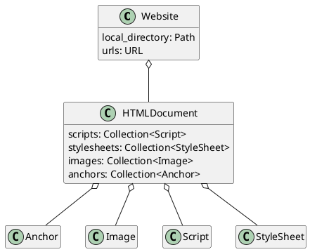

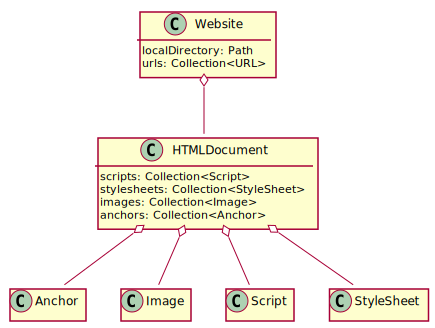

Take note of the first two classes:

  - `Website` - the website as a whole
  - `HTMLDocument` - a single HTML page (i.e., a single page within a site).

After the first two classes we have a class for each type of resource:

  - Image
  - Anchor
  - Script
  - StyleSheet

**Note that while we need to represent collections of data... we are not
interested in a specific data structure.** The `Collection` is a placeholder
for any data structure that can hold multiple items and be iterated over (e.g.,
`List` or `Vector`).


## Adding Some Detail

Let us explore what each class needs to store.

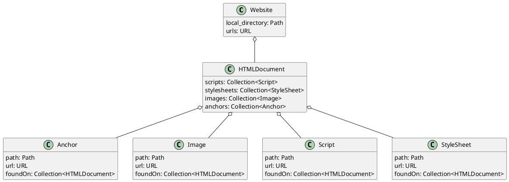

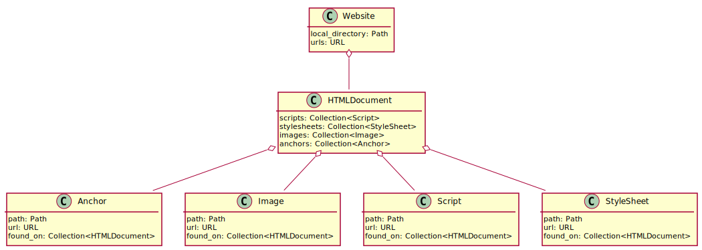


## Representing Types

Now we need a way to represent the notion of:

  - Internal
  - Intrapage
  - External

An Enumerated Type is perfect. An `enum` is similar to a `boolean` (`true` or
`false`). While a `boolean` is restricted to yes (`true`) or no (`false`)... an
`enum` is restricted to programmer-specified categories.


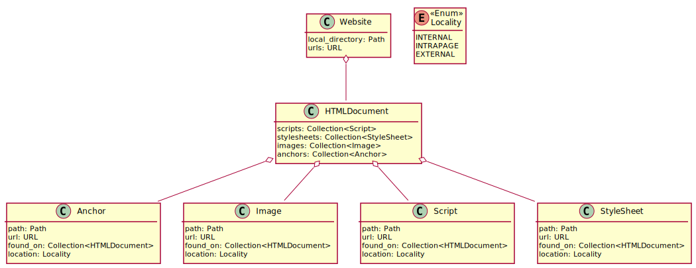

Take note of the new `Locality` box and additions to each of the resource
classes.


## Dealing with Duplication

The `Resource` classes are (at the moment) identical. Let us define a
`Resource` base class.


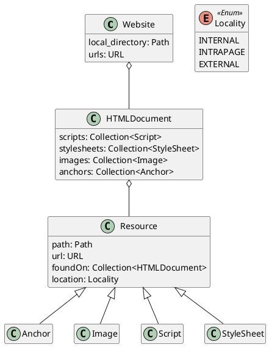

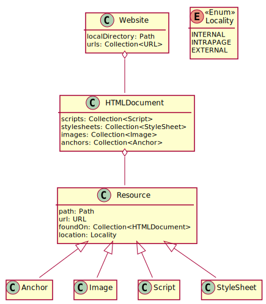

Now that we have factored out the common data members... it is tempting to
remove `Anchor`, `Image`, `Script`, and `Stylesheet`. However, I am not
comfortable doing so just yet. I have a few concerns, including

  1. Are there behaviors (e.g., member functions) that need to be captured?
  2. Will `abstract` methods or *dynamic binding* be useful during analysis?
  3. Will class-specific `static` constants be used?

Let us leave the classes for now. We can always remove them later.


## Introducing ResourceKind

Have you noticed that files are not represented in our current model? We could
introduce an "other" type. However, I think using `Resource` and adding another
`enum` is a better choice.


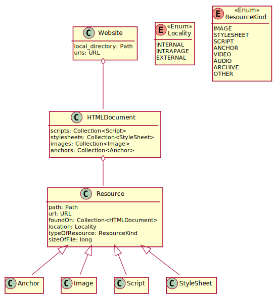

*I will leave adding all options to `ResouceKind` up to you and your team.*

Take note of the two new fields in `Resource`:

  - `typeOfResource: ResourceKind` - used to capture the type of file/resource
  - `sizeOfFile: long` - used to capture the file size (whether this in stored
    in KiB or MiB is an implementation detail)


## Done for Now

Based on the Website Analysis Requirements Definition it appears that we have
captured the structure of a website. It is safe to move on to capturing
analysis, exceptions, and report generation.


# Handling Analysis Details

Before starting this part of the lecture... I would like to discuss:

  - lazy evaluation
  - the Factory Pattern
  - the Builder Pattern


## Meet in the Middle

There is quite a bit of logic to implement. However, we are interested in:

  1. identifying the types of analysis that occur
  2. where each piece of analysis will occur
  3. splitting the analysis into manageable pieces/phases

To that end let us take a *meet-in-the-middle* approach to design. We already
have the structure of a website (i.e., where we will store the data generated during
analysis). Let us explore how to represent the various reports.


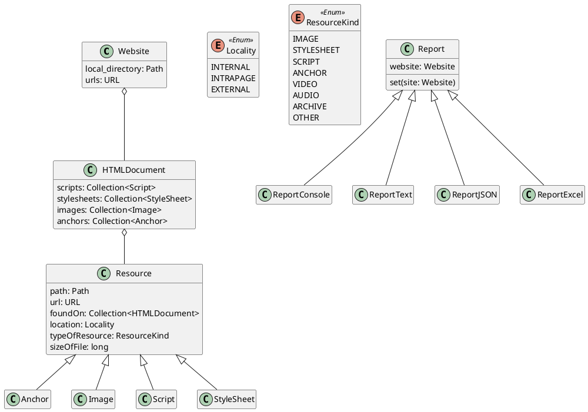

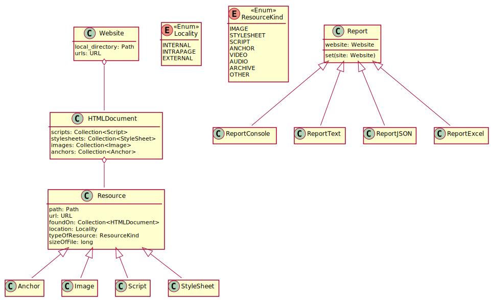

The reports will only examine the pieces of data that they need (and format
that data for output). The actual extraction, parsing, and analysis operations
(i.e., heavy lifting) should absolutely happen elsewhere in the software.

Take note of the `Report.set` method. I believe that a common report interface
(via inheritance) is appropriate here.


## Refining the Report Interface

Let us add a few methods to the `Report` interface.


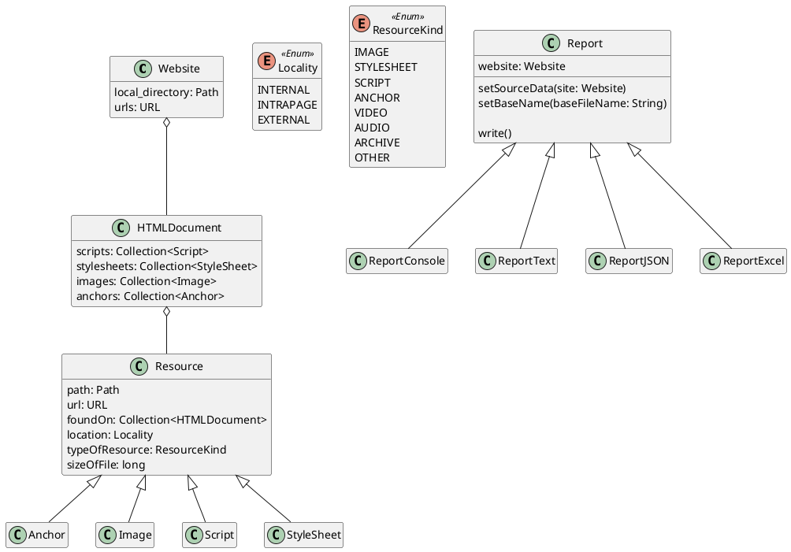


Take note of the three methods in `Report`:

  - `setSourceData(site: Website)` - renamed `Report.set` for clarity
  - `setBaseName(baseFileName: String)` - used to set the base report filename
    (e.g., `2023-06-23-165640`)
  - `write()` - used to generate and output the report

Note that `write` is intended a common `public` function that each report base
class will implement. The actual logic to generate a given report should happen
before `write` is called, e.g., in a `prepare` method.


## Inspiration from the C++ std::ostream, Java BufferedWriter & Python TextIO

I do not like the names of the `Report` classes. I would argue that these
classes do not represent the reports being generated, but the person who would
create these reports in a manual process.

Let us rename

  - `Report` to `ReportWriter`
  - `ReportConsole` to `ConsoleReportWriter`
  - `ReportText` to `TextReportWriter`
  - `ReportJSON` to `JSONReportWriter`
  - `ReportExcel` to `ExcelReportWriter`


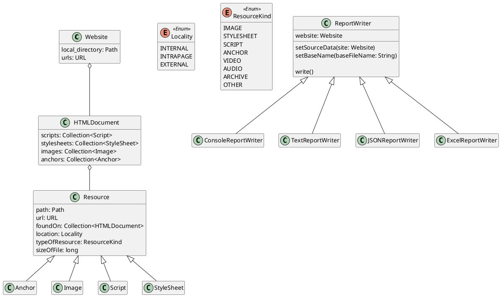

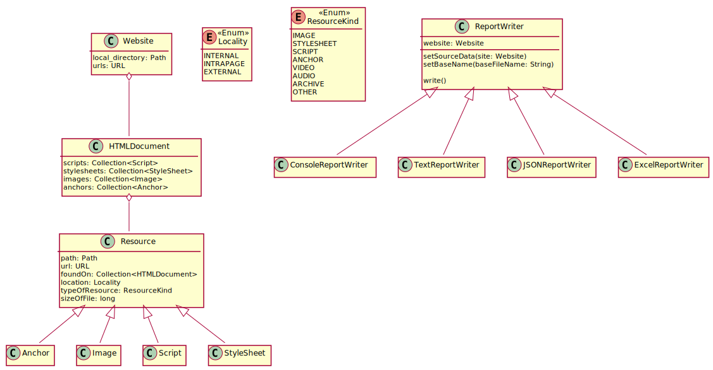


## Something Does Not Fit

Have you been wondering abour `ConsoleReportWriter`? It is different from the
other reports:

  1. It does **not** examine the `Website` data.
  2. It does not have a filename.

Perhaps it should really be a `ReportManager` class. A class that handles the:

  - [Date and Time](https://www.w3schools.com/java/java_date.asp) logic needed
    to set the basename for each report.

  - Coordination of sending all reports the same data, calling the `prepare`
    and `write` methods.


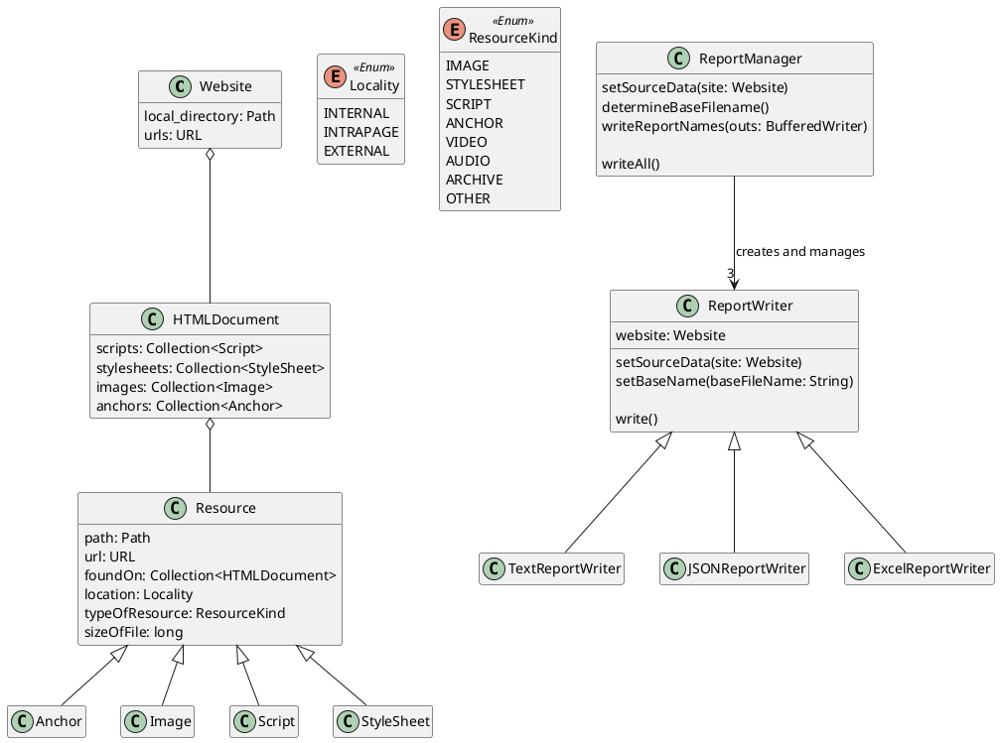

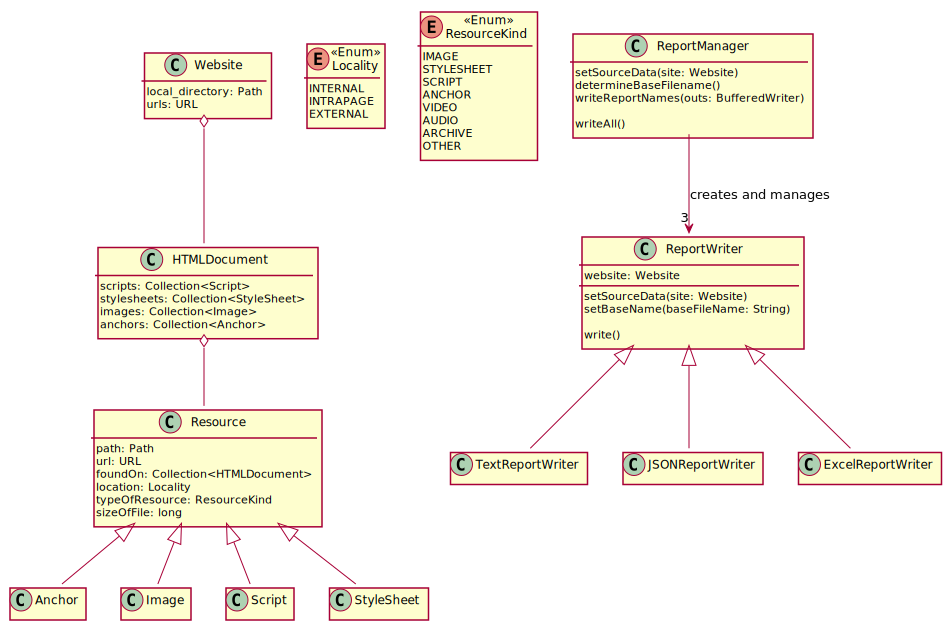

I am much happier with that. Note the four functions in `ReportManager`

  - `setSourceData(site: Website)` - same is in the `Report` interface
  - `determineBaseFilename()` - take the current date and time and format it accordingly

  - `writeReportNames(outs: BufferedWriter)` - output the filename for each
    file report. Note that the `BufferedWriter` is not necessary, but it will
    make development, testing, and debugging tremendously easy. [*Trust me
    Bro.*](https://www.youtube.com/watch?v=I1rCEL9uGwk). *Yes, that is a WAN Show
    reference.*

  - `writeAll()` - Handle calling each of the `ReportWriter` derived classes'
    `write` methods.


## Where is the Actual Analysis?

This is where the [Builder
Pattern](https://github.com/cstkennedy/cs330-examples/tree/master/Review-14-Python-Builder-Pattern/Example-3)
will come into play. Let us start by adding two classes:

  1. `WebsiteBuilder`
  2. `HTMLDocumentBuilder`


*Note: Let us stick with "Builder" even though "Parser" might be a more "intuitive" name.*


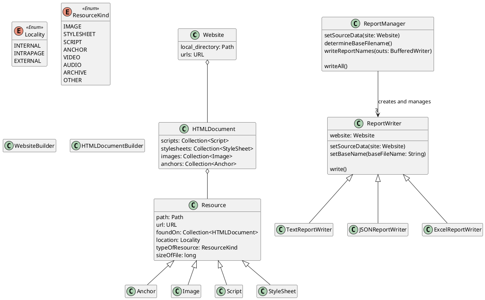

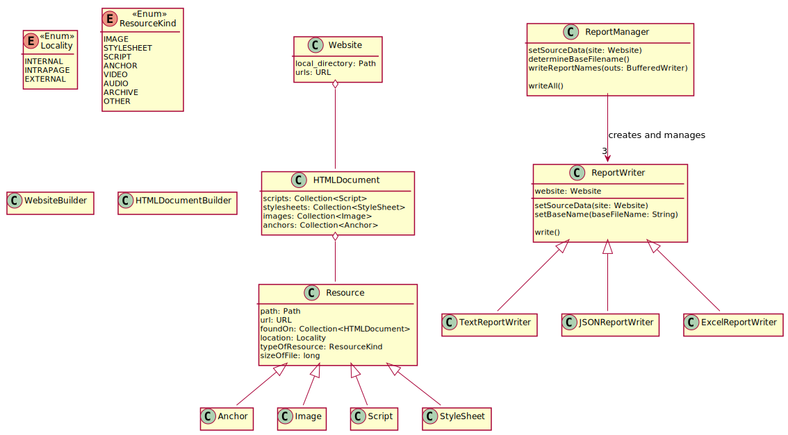

But... where do `WebsiteBuilder` and `HTMLDocumentBuilder` *fit*?

  1. `WebsiteBuilder` will be responsible for collecting all information needed to
    create a `Website` object:

    1. one local directory path
    2. one *or more* URLs

  2. `HTMLDocumentBuilder` will be responsible for extracting all tags from a
     *single* file containing HTML content. This is where our HTML parsing
     logic will exist.

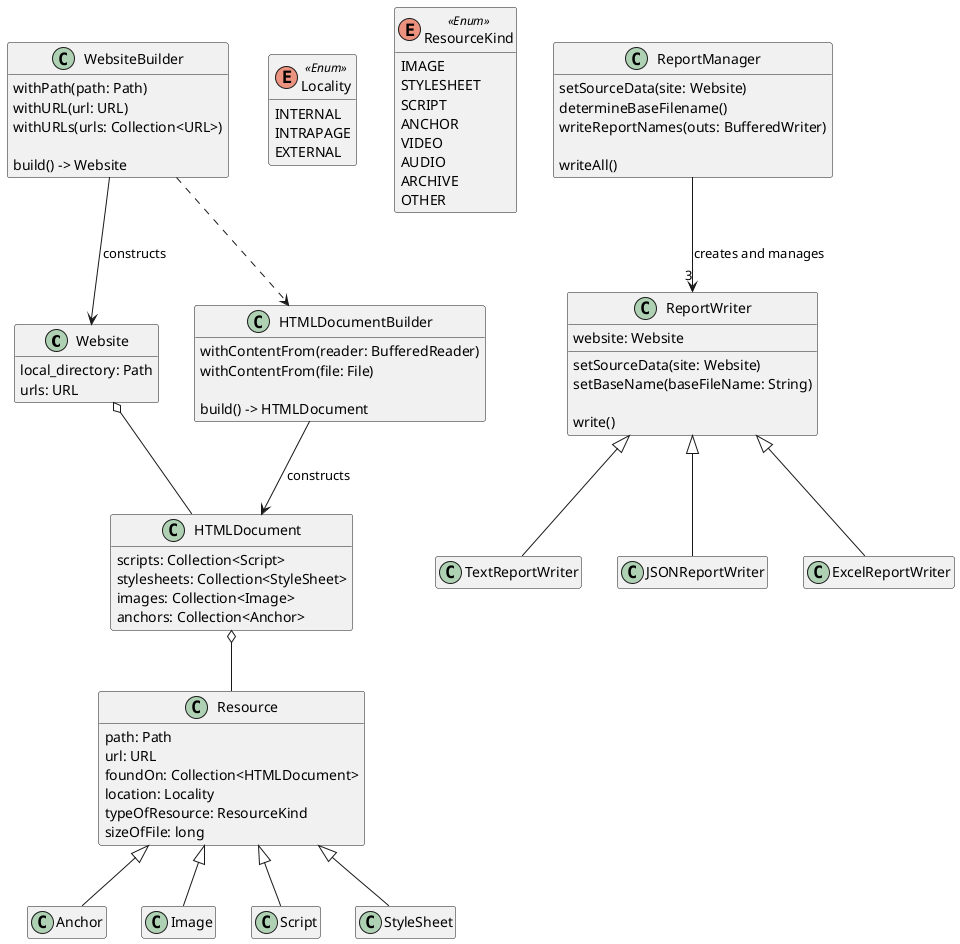

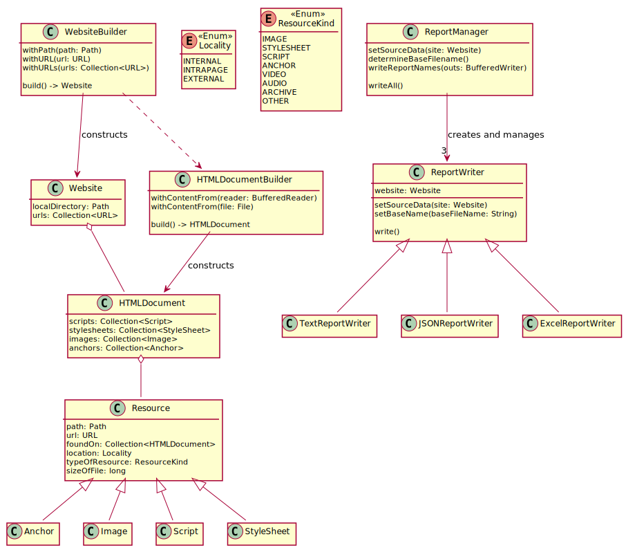

Take note of how `WebsiteBuilder` depends on `HTMLDocumentBuilder`. While the
former may identify files to examine... the latter handles the actual parsing.

You will also notice a few `with` methods. This convention is used to supply
*arguments* or *values* needed to create a non-trivial object (e.g., one that
requires File IO). In general... complicated initialization (e.g. random number
generation, file IO, nested object initialization) should **not** be done in a
constructor. *This is where the builder pattern can be particularly useful.*

The actual object creation does not occur until `build` is called.


# Closing Remarks & Guidance

  1. Use `BufferedReader` for input and `BufferedWriter` for output. This will
     make testing a lot easier.

     For example... `BufferedReader` can use either
     a `File` of a `String` as a data source. This allows us to

     - read a file in production code.
 
     - read a short piece of data from a hardcoded string in a unit test.

  2. There are quite a few missing methods. However, the only classes we need
     to add are `Exception`s and a driver class to wrap:

     ```java
     public static void main(String... args)
     ```

  3. We could simply the `Resource` handling by removing `Anchor` and its
     sibling classes (and ~20% of teams in previous Summer Semesters have taken
     this approach). However, my approach would introduce a `ResourceFactory` to
     simplify the creation logic.
